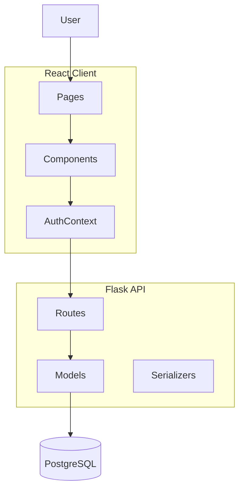

# App Architecture

```mermaid
flowchart TB
    User

    subgraph Frontend [React Client]
        Pages
        Components
        AuthContext
    end

    subgraph Backend [Flask API]
        Routes
        Models
        Serializers
    end

    Database[(PostgreSQL)]

    User --> Pages
    Pages --> Components
    Components --> AuthContext
    AuthContext --> Routes
    Routes --> Models
    Models --> Database
```
