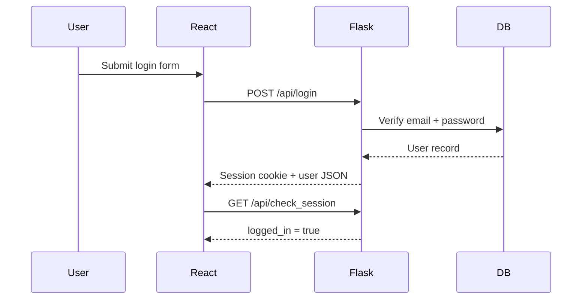

# Authentication & Session Flow

```mermaid
sequenceDiagram
    participant User
    participant React
    participant Flask
    participant DB

    User->>React: Submit login form
    React->>Flask: POST /api/login
    Flask->>DB: Verify email + password
    DB-->>Flask: User record
    Flask-->>React: Session cookie + user JSON

    React->>Flask: GET /api/check_session
    Flask-->>React: logged_in = true
```
