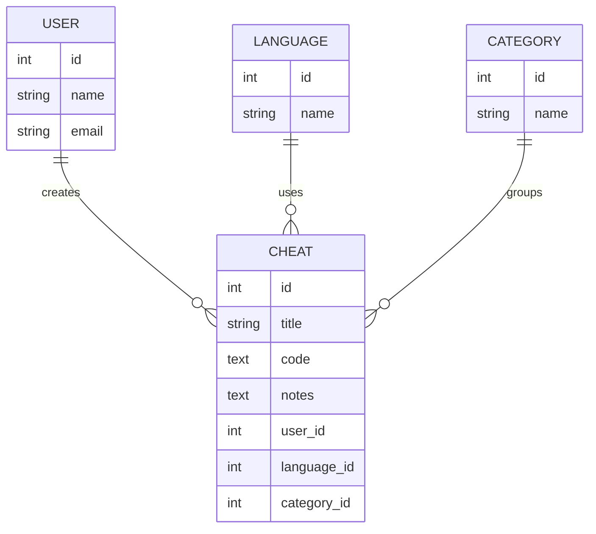

# Data Model

```mermaid
erDiagram
    USER ||--o{ CHEAT : creates
    LANGUAGE ||--o{ CHEAT : uses
    CATEGORY ||--o{ CHEAT : groups

    USER {
        int id
        string name
        string email
    }

    CHEAT {
        int id
        string title
        text code
        text notes
        int user_id
        int language_id
        int category_id
    }

    LANGUAGE {
        int id
        string name
    }

    CATEGORY {
        int id
        string name
    }
```
